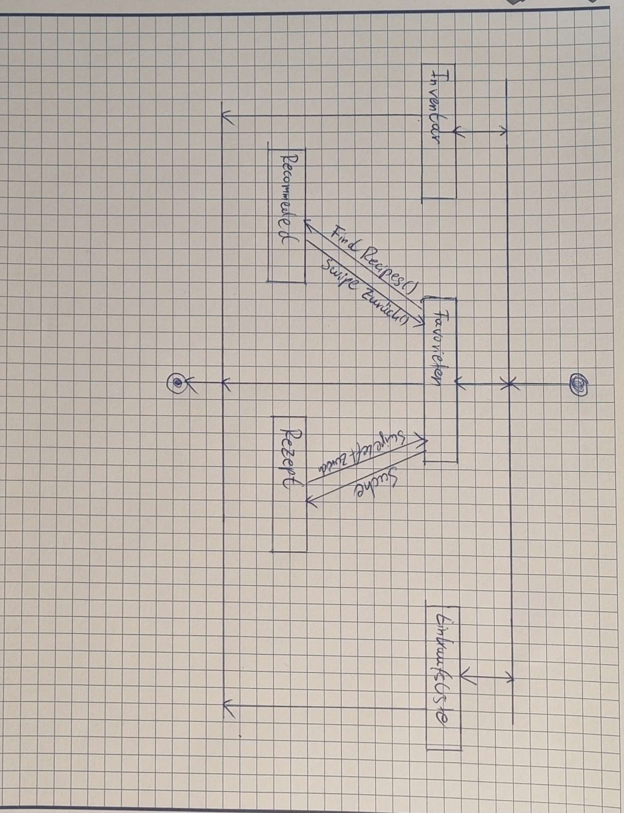
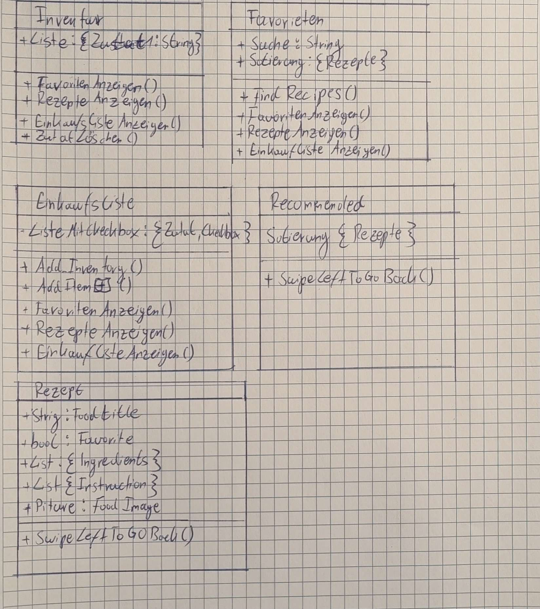

# Meilenstein 3

## Inhalt

*  [Navigationsübersicht und Screendiagramme](#navigationsübersicht-und-screendiagramme)
*  [Paper Prototypen](#paper-prototypen)
*  [Beschreibung der Testfälle](#beschreibung-der-testfälle)
*  [Zusammenfassung der wesentlichen Erkenntnisse und Anpassungen](#zusammenfassung-der-wesentlichen-erkenntnisse-und-anpassungen)

## Navigationsübersicht und Screendiagramme

### Navigationsübersicht

### Screendiagramme

## Paper Prototypen

Wir haben uns für ein Design mit 3 Haupt-Screens(Bild.1) entschieden, um die App möglichst simpel und easy-to-use zu gestalten. Zum Wechseln zwischen diesen Screens haben wir uns für eine Menüleiste entschieden.  Diese ist leicht verständlich und macht das schnelle Wechseln zwischen den 3 Screens möglich.

Das mittlere Design ist unser Startbildschirm. Auf diesem fanden wir es sinnvoll die favorisierten Rezepte, einen 'Find Recipe'-Button
eine Suchfunktion einzubauen, da diese oft benutzt werden. Der 'Find Recipe'-Button führt zu einem neuen Screen, der neue Rezeptvorschläge liefert. Bei auswählen der Suchleiste soll eine Tastatur erscheinen und nach der Suche sollen
passende Rezepte in Kacheln dargestellt werden (Bild.3). Dies scheint uns am benutzerfreundlichsten.

Als zweiten Screen haben wir uns für eine Inventarliste entschieden, da diese sehr nützlich ist um mit Vorräten hauszuhalten. Die Vorräte werden als Liste angezeigt, um es übersichtlich zu halten.

Das rechte Design ist eine Einkaufsliste, bei der man neue Elemente hinzufügen und, wenn diese besorgt wurden, dann direkt ins Inventar einpflegen kann. Zum hinzufügen eines Elements haben wir uns für einen '+'-Button entschieden, da dieser eine einfach zu verstehende Methode ist. Wird dieser betätigt, so erscheint ein Pop-Up, in dem man die jeweilige Zutat eintragen und der Liste hinzufügen kann. (Bild.2) Um jetzt ein Element dem Inventar hinzuzufügen, muss man erst die Checkbox rechts neben dem jeweiligen Element abhaken und dann den 'ADD TO INVENTORY' -Button benutzen. Wir denken, dass dies die einfachste Lösung ist, da auch das einfach zu verstehen ist und durch die Checkbox können Fehler beim Hinzufügen zum Inventar verhindert werden.

## Beschreibung der Testfälle

1. Es soll zwischen den 3 Hauptbildschirmen gewechselt werden
2. Ein Rezept soll gesucht werden
3. Eine Zutat soll in der Einkaufsliste hinzugefügt werden
4. Eine Zutat soll aus der Einkaufsliste dem Inventar hinzugefügt werden
5. Ein Rezept soll geöffnet und wieder geschlossen werden
6. Ein zufälliger Rezeptvorschlag soll ausgewählt und als Favorit markiert werden
7. Eine Zutat soll aus dem Inventar gelöscht werden

## Zusammenfassung der wesentlichen Erkenntnisse und Anpassungen

### Auswertung

Beim Start des Tests war der User zunächst etwas überfordert. Es war nicht ganz klar, was
genau die Screens für Einkaufs- und Inventarliste sein sollen. Durch die Menüleiste, wurde das wechseln zwischen den 3 Hauptbildschirmen(1) ohne Probleme abgeschlossen. Der User merkte jedoch an, dass die Icons der Menüleiste nicht sehr eindeutig seien. Auch das Suchen nach Rezept(2) verlief fehlerlos und wurde direkt verstanden. User war, bei Testfall 3, erst verwirrt durch den 'ADD TO INVENTORY'-Button. Jedoch war es dem User möglich ein Element der Einkaufsliste hinzuzufügen(3). Dies wurde durch den '+'-Button und das darauf folgende Pop-Up schnell verstanden. 

Beim Hinzufügen in die Inventarliste(4) war ein ähnliches Problem wir bei Testfall 3. Der User hat zwar dem Inventar ein Element hinzugefügt, wusste jedoch nicht was genau passiert ist. Es war also mehr oder weniger Zufall. Auch hier wurde es verständlich, sobald der Unterschied der zwei Listen erklärt wurde. Das Öffnen eines Rezeptes viel dem User leicht und auch die 'Favorit'-Funktion wurde direkt erkannt. Da wir uns dafür entschieden hatten ein Rezept mit einem Links-Swipe zu schließen, dauerte das schließen einige Zeit. Während der User auf dem Rezept-Screen war wurde bemängelt, dass Zutaten nicht direkt aus dem Rezept, der Einkaufsliste hinzugefügt werden können. Des weiteren wurde gewünscht das im Rezept markiert wird (farblich oä.), welche Zutaten sich bereits im Inventar/auf Lager befinden. 

Testfall 6 fiel dem User sehr schwer und es dauerte einige Minuten bis überhaupt die Rezeptvorschläge gefunden wurden. Es die Namensgebung des zugehörigen Buttons 'Find Recipes' wurde bemängelt, da dieser sich direkt unter der Suchleiste befindet und das den User in die Irre geführt hat. Nachdem jedoch die Rezeptvorschläge gefunden wurden, konnte der Rest von Testfall 6 abgeschlossen werden. Testfall 7 wurde auch schnell abgeschlossen, jedoch auch eher zufällig, da zu dem Zeitpunkt der Nutzen der Inventarliste noch nicht klar war. Das Löschen an sich, verlief ohne Zwischenfälle. Nachdem die Tests durchlaufen waren, hat der User außerdem bemängelt, dass im 'recommended' und im 'Rezept' -Screen keine Menüleiste befindet. Der User merkte des weiteren an, dass z.b. beim erfolgreichen Hinzufügen eines Elements von Einkaufs- in Inventarliste, eine Bestätigung(Pop-Up oä) hilfreich wäre. Auch wurde die Shoppingliste an sich sehr positiv aufgenommen.

### Reflexion

Im Interview hat sich vor allem die Verwirrung zwischen Inventar und Einkaufliste und die schlechte Namensgebung des Buttons zum 'recommended'-Screen hervorgehoben. Um dies zu lösen, aber auch um die App allgemein besser verständlich zu machen, könnte man beim 1. Start der App ein Pop-Up zu erstellen, welches dem User die App kurz erklärt.

Die Menüleiste wurde positiv aufgenommen,denn sie ermöglichte dem User, ohne Probleme, zwischen den Hauptbildschirmen zu wechseln. Der einzige Mangel waren die Icons, die nicht eindeutig genug waren, und das Fehlen der Menüleiste auf manchen Screens.

Die Suche nach Rezepten wurde schnell und fehlerfrei durchgeführt, was darauf schließen lässt, dass dieser Bereich benutzerfreundlich ist.

Das Hinzufügen von Elementen in die Einkaufsliste verlief stockend, da der Benutzer erst den falschen Button benutzte. Als dann der richtige Input passierte, klärte es sich jedoch auch und wurde dann im Nachhinein auch verstanden. Ähnlich war das Problem beim hinzufügen auf die Inventarliste. Hier war der User zwar schnell in der Lage ein Element hinzuzufügen, war sich aber dessen nicht bewusst. Bei beiden Fällen könnten Hinweise oder Erklärungen beim Verständnis helfen.

Der Vorgang um Rezepte zu öffnen und als Favoriten zu markieren wurde schnell erkannt und verlief ohne Zwischenfälle. Allerdings hat das Schließen des Rezeptes (durch einen Links-Swipe) etwas länger gedauert. Des weiteren wurde währenddessen gewünscht mehr Funktionen auf den 'Rezept'-Screen zu bringen. Zum einen eine Markierung vorhandener Zutaten des Rezepts um schneller dessen Verfügbarkeit festzustellen, ohne wieder auf die Inventarliste wechseln zu müssen. Zum anderen eine Funktion die es erlaubt im Rezept Zutaten direkt in die Einkaufsliste einzufügen, sodass auch hier der Screen nicht gewechselt werden muss.

Das Finden der Rezeptvorschläge hat besonders lange gedauert. Hier wurde die Namensgebung und die Platzierung des zugehörigen Buttons bemängelt. Dies kann durch bessere Namengebung oder andere Platzierung verbessert werden. Das Löschen eines Elements aus der Inventarliste verlief reibungslos, jedoch war sich der User auch hier nicht ganz bewusst was er da löschte. 

Zusammengefasst hat uns das Interview viele Einsichten in die Benutzererfahrung geliefert. Man kann erkennen, dass Hinweise oder eine Hilfe erforderlich ist um Verwirrungen vorzubeugen. Auch in Sachen Benutzerfreundlichkeit, haben wir mit den Vorschlägen den 'Rezept'-Screen zu verbessern und eventuell einer anderen Schließmethode der Rezepte, Erkenntnisse gewonnen.
