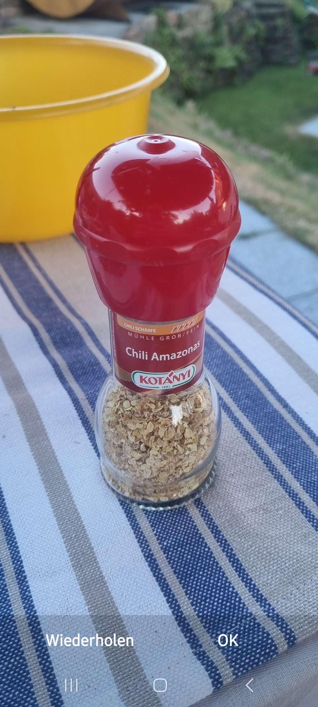

# Meilenstein 5

## Ergebnisse der App mit Screenshots
Die gesamte App ist nur im Vertikalen Modus einsetzbar, dies ist begründet durch die einhändige Bedienung die dadurch resultiert. Beim Kochen oder wenn man am Einkaufen ist kann man so die App mit einer Hand einfach bedienen.

### Home Screen / Favorite Screen

Hier ist der Home Screen / Favorite Screen abgebildet, in diesem befindet sich wie auf jeder Screen die Navigation Bar unten am Bildschirm. Desweiteren sind auf dieser Bildschirm die Suchleiste für die Rezepte, der Recommended Knopf um neue Rezepte zu finden sowie der Add Recipte Button bei welchem man eigene Rezepte hinzufügen kann. Favoriten werden hier angezeigt. 

### Home Screen / Favorite Screen -> Recommended Screen

Wenn man im Home Screen auf Recommended klickt kommt man hier drauf und kann über die Suchleiste Rezepte suchen, je nachdem was einem gefallen würde. 

### Home Screen / Favorite Screen -> Recommended Screen -> Recipte klicked

Hier kann man sich die Rezepte anschauen auf die man im Recommended Screen geklicked hat. Über den Stern rechts oben kann ein Rezept als Favorit hinzugefügt werden.

Hier wurde ein Rezept über den Stern als Favorit hinzugefügt.

### Home Screen / Favorite Screen -> Add Recipt

Wenn man auf den Add Recipt Button drückt, kann man ein Rezept hinzufügen. Wobei dort die Inhaltsstoffe, sowie die einzelnen Schritte angegeben werden können.

Bei den Rezepten kann man auch eigene Bilder von der jeweiligen Mahlzeit machen.

Hier sieht man wie bei dem neuen Rezept das neue Bild angezeigt wird.

### Shoppinglist 

Wenn man über die Navigation Bar auf "Shopping List" drückt landet man auf dem Shopping List Screen, hier kann ein EInkaufszettel geschrieben werden wobei über das "+" die einzelnen Items in die Liste gepushed werden und über "Add Items zu Inventory" die Items aus der Shoppinglist in das Inventory übertragen werden und dann auch aus der Shoppinglist gelöscht werden.

Hier werden die Items ausgewählt.

Hier wurde diese mit dem "Add to Inventory" Button aus der Shopping List ins Inventory gepushed.

### Inventory 

Wenn man über die Navigation Bar auf "Inventory" drückt landet man auf dem Inventory Screen, hier werden die Items angezeigt die man eingetragen hat und über den Add to Inventory können auch hier noch weitere Lebensmittel hinzugefügt werden.
